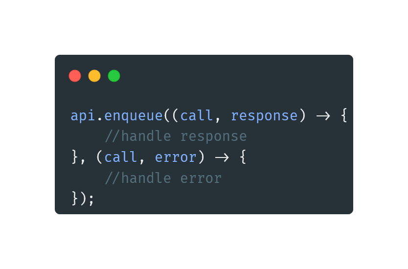

# yarca or Yet Another Retrofit Call Adapter

**yarca** is an opinionated retrofit call adapter. it's the result of multiple iterations of custom retrofit call
adapters that I used in various personal projects.

The fundamental difference between this call adapter and the default retrofit call adapter is that this adapter's
callbacks use Java lambda expressions instead of default unpleasant anonymous class callbacks. This library provides
multiple ways to handle response and error using various callbacks.

---

| Icon |                Item                 |
|:----:|:-----------------------------------:|
|  📺  |       [**Preview**](#Preview)       |
|  📱  | [**Compatibility**](#Compatibility) |
|  💻  |         [**Usage**](#Usage)         |
|  📩  |      [**Download**](#Download)      |
|  📋  |      [**Features**](#Features)      |
|  🧾  |     [**Changelog**](#Changelog)     |
|  ⚖️  |       [**License**](#License)       |

---

## Preview



## Compatibility

**JVM11+**

## Usage

1. Add it to your retrofit builder:

```java
var retrofit=new Retrofit.Builder()
        .baseUrl(...)
        .addConverterFactory(...)
        .addCallAdapterFactory(new CallXAdapterFactory())
        .build();
```

2. Define your API return type with `CallX` instead of `Call`

```java
interface APIs {

    @GET("posts")
    CallX<List<Post>> getPosts();
}
```

3. Use it in your API call:

```java
api.enqueue((call,response)->{
        //handle response
        },(call,error)->{
        //handle error
        });
```

## Download

Find the latest version
from [Maven Artifact](https://repo1.maven.org/maven2/io/github/yamin8000/yarca/maven-metadata.xml)

### Gradle Groovy DSL

**Step 1.** Add the Maven repository to your build file  
Add it in your root build.gradle at the end of repositories:

```groovy
repositories {
    mavenCentral()
}
```

**Step 2.** Add the dependency

```groovy
dependencies {
    implementation 'io.github.yamin8000:yarca:$last_version'
}
```

### Maven

Add the dependency

```xml

<dependency>
    <groupId>io.github.yamin8000</groupId>
    <artifactId>yarca</artifactId>
    <version>$last_version</version>
    <type>aar</type>
</dependency>  
```

### Gradle Kotlin DSL

```groovy
dependencies {
    implementation("io.github.yamin8000:yarca:$last_version")
}
```

## Features

There are different methods and callbacks, here is the table of some of them:

<table>
<tr>
<th>Type</th>
<th>Description</th>
<th>Code Example</th>
</tr>

<tr>
<td><code>enqueue</code></td>
<td>A lambda wrapper around default <code>enqueue</code> method</td>
<td><pre>
api.enqueue((call,response)->{
    //handle response
}, (call,error)->{
    //handle error
});
</pre></td>
</tr>

<tr>
<td><code>async</code></td>
<td>General purpose async call method.</td>
<td><pre>
api.async((response, error) -> {
    //handle response and error
    boolean isShuttingDown = false;
    return isShuttingDown;
});
</pre></td>
</tr>

<tr>
<td><code>atomicAsync</code></td>
<td>Calls <code>async</code> and automatically shuts down the client.</td>
<td><pre>

</pre></td>
</tr>

<tr>
<td><code>enqueueAsync</code></td>
<td>Calls <code>async</code> and doesn't care whether to shut down the client or not.</td>
<td><pre>

</pre></td>
</tr>

<tr>
<td><code>asyncBody</code></td>
<td>Calls <code>async</code> but returns response body instead of <code>OkHttp's</code> Response class</td>
<td><pre>

</pre></td>
</tr>

</table>

## Changelog

- 1.0.0 - Initial release

## License

> yarca is licensed under the **[GNU General Public License v3.0](./LICENSE)**  
> Permissions of this strong copyleft license are conditioned on making  
> available complete source code of licensed works and modifications,  
> which include larger works using a licensed work, under the same  
> license. Copyright and license notices must be preserved. Contributors  
> provide an express grant of patent rights.
